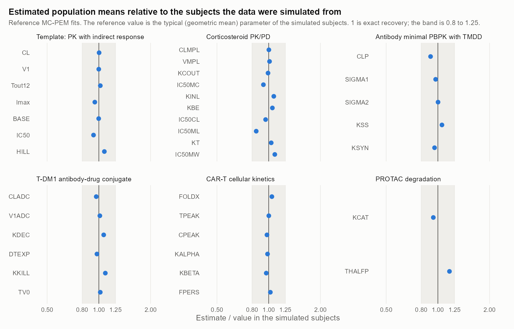

# Population PK/PD models for S-ADAPT

Six pharmacokinetic/pharmacodynamic models written for
[S-ADAPT](https://bmsr.usc.edu/downloads/s-adapt/) with the SADAPT-TRAN
pre-processor, each with a simulated study and a population fit of it. The
[PBPK](https://github.com/Wrlog/PBPK) and [QSP](https://github.com/Wrlog/QSP)
repositories simulate published models; this one takes four of those
models, and two more, through the other half of the work: estimating the
parameters from data.

S-ADAPT is the population version of ADAPT, written by Robert Bauer. It
fits nonlinear mixed-effects models by Monte Carlo parametric expectation
maximisation (MC-PEM), which handles the large mechanistic models of
systems pharmacology without linearising them. The corticosteroid model
here is from an analysis done that way: Hong, Mager, Blum and Jusko
(*Pharm Res* 2007) fitted cortisol, lymphocyte trafficking and lymphocyte
proliferation together in S-ADAPT.

**What has and has not been run.** S-ADAPT is free, but its licence does not
allow it to be redistributed and it needs a Fortran compiler, so it is not
in this repository and the fits shown here were not made with it. They come
from a reference MC-PEM written in R for this repository, which compiles
the same model files with gfortran. Running the models in S-ADAPT itself is
the next step, and [docs/RUNNING_SADAPT.md](docs/RUNNING_SADAPT.md) says
how, with a checklist of what to confirm on the first run.

This is for research and teaching only. Nothing here is validated for
clinical use or should guide the treatment of a patient.

## The models

| Model | What it describes | What is estimated | Source |
|---|---|---|---|
| [Template](models/idr1_template) | One-compartment PK with a zero-order infusion, driving indirect response model I (inhibition of production) | CL, V, response half-life, Imax, baseline, IC50, Hill coefficient | The worked example of Bulitta et al., *AAPS J* 2011;13:201 (Fig. 4, Table I) |
| [Corticosteroid](models/corticosteroid_hong2007) | Methylprednisolone PK; suppression of circadian cortisol secretion; lymphocyte trafficking inhibited jointly by cortisol and drug; ex vivo lymphocyte proliferation through a transit delay | CL, V, cortisol elimination, four IC50s, lymphocyte input and trafficking rates, transit rate | Hong, Mager, Blum & Jusko, *Pharm Res* 2007;24:1088 |
| [Antibody](models/mab_mpbpk_tmdd) | Trastuzumab in a minimal PBPK model (plasma, tight and leaky interstitial fluid, lymph) with target-mediated disposition in the interstitial fluid | Plasma clearance, the two vascular reflection coefficients, Kss, target synthesis rate | Cao & Jusko, *J Pharmacokinet Pharmacodyn* 2014;41:375 |
| [T-DM1](models/adc_tdm1) | Antibody-drug conjugate in tumour-bearing mice: plasma PK of total antibody and conjugate, deconjugation, tumour uptake, HER2 binding, internalisation, DM1 release and tubulin binding, tumour killing | Clearance, central volume, deconjugation rate, tumour doubling time, killing constant, initial tumour volume | Singh & Shah, *AAPS J* 2017;19:1054 |
| [CAR-T](models/cart_stein2019) | Tisagenlecleucel transgene in blood: expansion to a peak, fast contraction, slow persistence | Fold expansion, time and height of the peak, the two decline rates, persisting fraction | Stein et al., *CPT Pharmacometrics Syst Pharmacol* 2019;8:285 |
| [PROTAC](models/protac_kcat) | Target protein degradation in cells: ternary-complex engagement with a hook effect, and catalytic degradation on top of target turnover, at six concentrations in each experiment | kcat, target half-life | *Pharmaceutics* 2023;15:195 |

Each model folder holds:

- `final_model.ctl`: the SADAPT-TRAN control stream, the model itself.
- `parameter_settings.csv`: initial estimates, parameter types and
  transformations, and the estimation settings.
- `design.R`: the simulated study (doses, sampling times, number of
  subjects) and the population it is drawn from.

### Notes on each model

- **Template.** The control stream and the parameter table are the
  published ones; of the run settings only the file names and the number
  of iterations differ. The population values of the simulated study are
  chosen for the exercise.
- **Corticosteroid.** Equations 1-3 and 6-8 of the paper, with its
  methylprednisolone estimates (Tables I-IV) as the population means,
  between-subject variability and residual variability. The paper's
  residual model is a variance proportional to the squared prediction, used
  here. Two things differ from the paper. It described each subject's
  cortisol baseline with a three-harmonic Fourier series whose coefficients
  it does not report; here the baseline is one harmonic with illustrative
  values (mean 80 ng/mL, amplitude 55 ng/mL, peak an hour before dosing).
  And the paper's inter-occasion variability is left out: each simulated
  subject is studied once.
- **Antibody.** The equations of the
  [PBPK repository's model file](https://github.com/Wrlog/PBPK/blob/main/models/mab_mpbpk_tmdd.cpp)
  for a 70-kg subject, with target degradation and complex internalisation
  fixed at the published 0.0117 1/h.
- **T-DM1.** The equations of the
  [QSP repository's model file](https://github.com/Wrlog/QSP/blob/main/models/adc_tdm1_singh2017.cpp)
  with mouse PK and the KPL-4 xenograft. Tumour volume is in mm3 so that
  every state is of a size the solver's absolute tolerance suits. Tumour
  and cell parameters are fixed at the published values in `$OUTPUT_GLB`;
  the plasma and growth parameters are estimated.
- **CAR-T.** The published model is a function of time with a switch at the
  peak. As differential equations that switch is a discontinuity the
  solver can step over, so the control stream writes the function directly
  in `$OUTPUT_EQN` and uses one differential equation only to carry time.
  The comedication factors of the paper (estimated near 1) are left out.
- **PROTAC.** An experiment measures all six concentrations, so one
  "subject" is one experiment with six arms: twelve differential equations
  and six outputs. Fitting each concentration as a separate subject leaves
  most subjects with no information on the target half-life. The binding
  constants and cooperativity are fixed, as measured values would be.

## How the model files were checked

S-ADAPT compiles what SADAPT-TRAN makes of the control stream, so a model
file can be wrong in two ways: it can fail to compile, or compile to the
wrong model. Both are checked here without S-ADAPT.

[engine/ctl.R](engine/ctl.R) does what the paper says SADAPT-TRAN does: it
turns the control stream into Fortran subroutines, converts numbers to
double precision, limits the arguments of `EXP` and `LOG`, and refuses any
name used before it is defined. The result is compiled with gfortran and
integrated with LSODA, the solver ADAPT and S-ADAPT use
([engine/driver.f](engine/driver.f), [engine/odepack](engine/odepack)).

`tests/test_models_vs_mrgsolve.R` then compares every model with an
[mrgsolve](https://mrgsolve.org) model written independently of it
([reference/](reference)): the four model files of the PBPK and QSP
repositories, and two written for this check. They agree to within
3e-4, relative, at the tolerances of the settings files.

The control streams keep to the syntax of the published example: no
comments, no continuation lines, lines under 60 characters (SADAPT-TRAN
writes them into 72-column Fortran), products instead of integer powers.
That is why the model descriptions are in this README and not in the files.

## Simulate, then fit

Each model has a simulated study, drawn from known population values with
between-subject and residual variability ([run/01_simulate.R](run/01_simulate.R),
datasets in [data/](data)). Fitting it from the deliberately poor initial
estimates of the settings file shows whether the model's parameters can be
estimated from that kind of study, before any real data are involved.

The fits here are by [engine/mcpem.R](engine/mcpem.R), a plain
implementation of importance-sampling MC-PEM (Bauer & Guzy 2004), the
method S-ADAPT runs for `PMETHOD 4`. It reads the same settings file:
initial means and variances, the block structure of the variance matrix,
log-normal, normal and logistic parameters, the variance burn and
burn-then-shrink phases, and bounds. It is not S-ADAPT: it has none of
S-ADAPT's sampling refinements, gives no standard errors, and its objective
function is on its own scale.

### What came back



Every estimated population mean is within 17% of the typical value in the
subjects it was estimated from, and most are within 5%.

| Model | Subjects | Observations | Means estimated | Iterations | Median error | Largest error |
|---|---|---|---|---|---|---|
| Template | 30 | 630 | 7 | 300 | 2.0% | Hill coefficient +7.7% |
| Corticosteroid | 32 | 1448 | 10 | 150 | 4.6% | IC50 of drug on trafficking -15.4% |
| Antibody | 48 | 528 | 5 | 200 | 4.3% | plasma clearance -9.3% |
| T-DM1 | 40 | 680 | 6 | 150 | 3.0% | killing constant +9.1% |
| CAR-T | 60 | 960 | 6 | 150 | 2.3% | fold expansion +4.3% |
| PROTAC | 12 | 504 | 2 | 150 | 11.4% | target half-life +16.8% |

The errors are relative to the geometric mean of the parameters the
simulated subjects actually had, which separates the estimation from the
luck of the draw: in the CAR-T study, where fold expansion varies between
patients by a factor of ten, the 60 patients drawn happen to sit 42% above
the population value, and the estimate follows them. Full tables, with the
population values, the between-subject variances and the residual
parameters, are in `results/reference/<name>/estimates.csv`, with the
iteration history, each subject's parameters and the predictions beside
them. `fit.png` and `convergence.png` in the same folders are the two plots
to look at first.

What the fits show beyond the means:

- **Is one dataset's error bias or chance?** The PROTAC fit is the furthest
  off, so that study was simulated and fitted 16 more times
  ([run/04_replicates.R](run/04_replicates.R)). On average kcat came back
  within 0.0% (standard error 0.7%) of the simulated experiments and the
  half-life within 1.5% (1.6%). The estimator is not biased; twelve
  experiments just leave that much uncertainty. S-ADAPT has commands for
  the same check (`popsets_simulate`, `popsets_fit`).
- **Between-subject variances are harder than means.** About three
  quarters are within 25% of the variance in the simulated subjects. They
  come out too small where one subject's data say little about the
  parameter: the T-DM1 deconjugation rate and killing constant (about 0.4
  of the variance simulated), and the antibody's clearance and Kss (0.6).
- **Iterations.** The template needed about 250 iterations before Imax,
  IC50 and the Hill coefficient stopped moving; at the 150 of the
  published example they were still drifting. Each settings file carries
  the number its model needed.
- **Design decides what can be estimated.** The antibody model was first
  simulated at 0.3 to 8 mg/kg, where target-mediated elimination dominates
  in most subjects, and clearance came back 42% low. Widening the doses to
  0.5 to 20 mg/kg was not enough on its own: clearance was still 23% low,
  at a better objective function than the true values gave, because serum
  data cannot tell a subject's clearance from their tight-tissue
  reflection coefficient. Giving the reflection coefficients almost no
  between-subject variance, estimated with SADAPT-TRAN's variance
  burn-then-shrink setting, and twelve subjects a group instead of eight,
  fixed it.
- **Residual error.** The proportional parts come back within 10% of the
  simulated values. The additive parts are less well determined (0.63 to
  0.85 of the simulated value in these datasets), because an additive and
  a proportional part are hard to tell apart; over the PROTAC replicates
  the additive part averaged 2.09 against 2 simulated.

## Running it

The reference engine needs R with a Fortran compiler (Rtools on Windows),
and `mrgsolve` for one of the tests.

```sh
Rscript run/01_simulate.R         # simulate every dataset
Rscript run/02_fit_reference.R    # fit them with the reference MC-PEM
Rscript run/03_plots.R            # diagnostic plots
Rscript run/04_replicates.R protac_kcat   # repeat one study 16 times
```

Each script takes model names as arguments to do only those. Tests, from
the repository root:

```sh
Rscript tests/test_control_streams.R     # the pre-processor's checks; base R
Rscript tests/test_models_vs_mrgsolve.R  # every model against mrgsolve
Rscript tests/test_reference_fit.R       # a short fit of the template
```

Using a model directly:

```r
for (f in c("ctl.R", "build.R", "simulate.R", "mcpem.R")) source(file.path("engine", f))
m <- load_model("mab_mpbpk_tmdd")
p <- read_design("mab_mpbpk_tmdd")$truth[m$par$PNAME]
nmol <- 4 * 70 * 1e6 / 148000                       # 4 mg/kg in a 70-kg subject
sa_profile(m, p, dose_rec(0, cmt = 1, amt = nmol, rate = nmol / 1.5), times = c(1.5, 24, 168, 504))
```

To run a model in S-ADAPT, see [docs/RUNNING_SADAPT.md](docs/RUNNING_SADAPT.md).

## Layout

- `models/<name>/`: control stream, parameter settings and study design
- `data/`: the simulated datasets, in the layout S-ADAPT reads, with the
  parameters each subject was simulated from
- `engine/`: the reference engine (control-stream translator, LSODA driver,
  dataset simulator, MC-PEM)
- `reference/`: the mrgsolve models the control streams are checked against
- `run/`: the scripts that simulate, fit and plot
- `results/reference/`: estimates, iteration histories, predictions and
  plots from the reference fits
- `results/sadapt/`: for S-ADAPT's exported results
- `tests/`: the checks, run on every push
- `docs/`: how to run the models in S-ADAPT

## References

- Bauer RJ, Guzy S. Monte Carlo parametric expectation maximization (MC-PEM)
  method for analyzing population pharmacokinetic/pharmacodynamic data. In:
  D'Argenio DZ, ed. *Advanced Methods of Pharmacokinetic and Pharmacodynamic
  Systems Analysis*, vol 3. Kluwer; 2004:135-163.
- Bauer RJ, Guzy S, Ng C. A survey of population analysis methods and
  software for complex pharmacokinetic and pharmacodynamic models with
  examples. *AAPS J* 2007;9:E60-E83.
- Bulitta JB, Bingölbali A, Shin BS, Landersdorfer CB. Development of a new
  pre- and post-processing tool (SADAPT-TRAN) for nonlinear mixed-effects
  modeling in S-ADAPT. *AAPS J* 2011;13:201-211.
- Hong Y, Mager DE, Blum RA, Jusko WJ. Population
  pharmacokinetic/pharmacodynamic modeling of systemic corticosteroid
  inhibition of whole blood lymphocytes: modeling interoccasion
  pharmacodynamic variability. *Pharm Res* 2007;24:1088-1097.
- Cao Y, Jusko WJ. Incorporating target-mediated drug disposition in a
  minimal physiologically-based pharmacokinetic model for monoclonal
  antibodies. *J Pharmacokinet Pharmacodyn* 2014;41:375-387.
- Singh AP, Shah DK. Application of a PK-PD modeling and simulation-based
  strategy for clinical translation of antibody-drug conjugates: a case
  study with trastuzumab emtansine (T-DM1). *AAPS J* 2017;19:1054-1070.
- Stein AM, Grupp SA, Levine JE, et al. Tisagenlecleucel model-based
  cellular kinetic analysis of chimeric antigen receptor-T cells. *CPT
  Pharmacometrics Syst Pharmacol* 2019;8:285-295.
- A mechanistic pharmacodynamic modeling framework for the assessment and
  optimization of proteolysis targeting chimeras (PROTACs). *Pharmaceutics*
  2023;15:195.

## License

MIT. `engine/odepack/` is ODEPACK, which is in the public domain.
